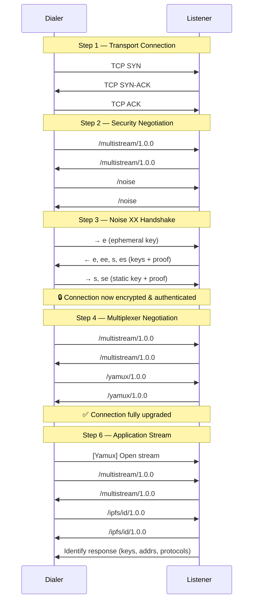
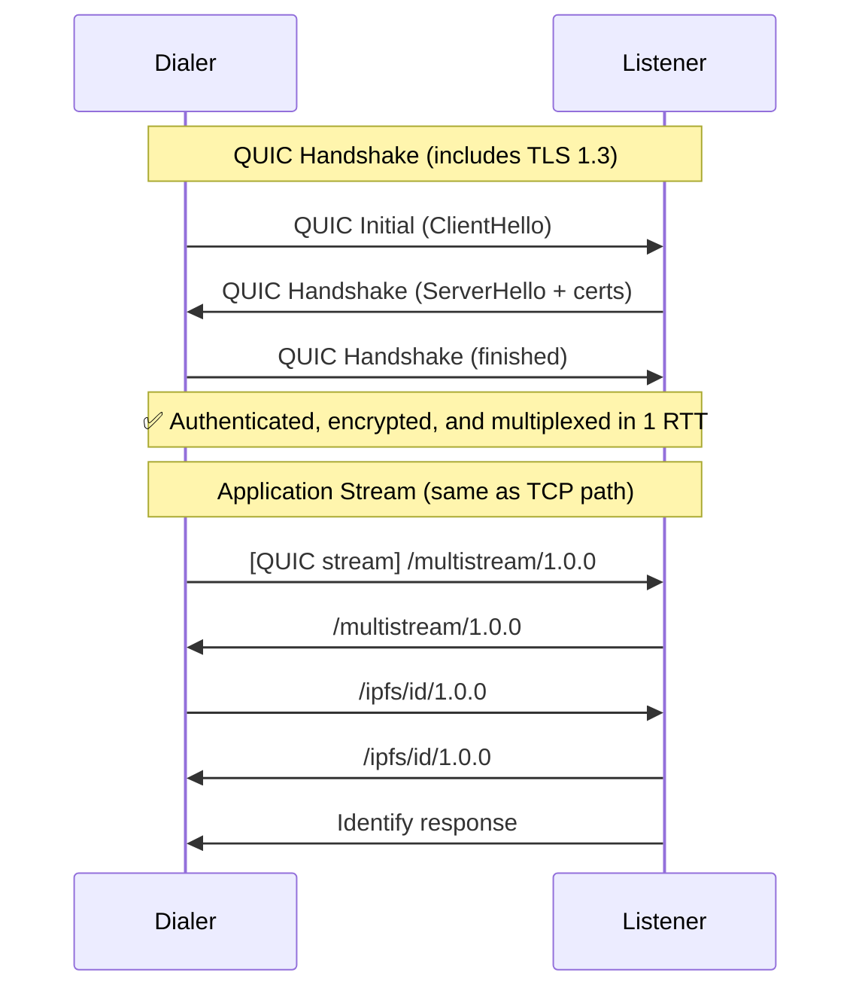

# Connection Upgrade Flow

> A step-by-step walkthrough of how a raw transport connection is upgraded into
> a fully authenticated, multiplexed libp2p connection ready for application
> protocol streams.

## Table of Contents

- [Overview](#overview)
- [Prerequisites](#prerequisites)
- [Step 1: Transport Connection](#step-1-transport-connection)
- [Step 2: Security Protocol Negotiation](#step-2-security-protocol-negotiation)
- [Step 3: Security Handshake](#step-3-security-handshake)
- [Step 4: Multiplexer Negotiation](#step-4-multiplexer-negotiation)
- [Step 5: Connection Ready](#step-5-connection-ready)
- [Step 6: Opening Application Streams](#step-6-opening-application-streams)
- [Full Upgrade Sequence Diagram](#full-upgrade-sequence-diagram)
- [QUIC: Integrated Upgrade](#quic-integrated-upgrade)
- [WebRTC: Browser-Compatible Upgrade](#webrtc-browser-compatible-upgrade)
- [Early Multiplexer Negotiation](#early-multiplexer-negotiation)
- [Error Handling and Timeouts](#error-handling-and-timeouts)
- [References](#references)

## Overview

When a libp2p node dials another peer over a non-integrated transport like TCP,
the raw connection must be **upgraded** through several stages before it can
carry application data. This process transforms an insecure, single-stream
connection into a secure, multiplexed channel.

The upgrade sequence for TCP-based transports follows this order:

```
Raw TCP Connection
    │
    ▼
Security Protocol Negotiation (multistream-select)
    │
    ▼
Security Handshake (e.g., Noise XX)
    │
    ▼
Multiplexer Negotiation (multistream-select)
    │
    ▼
Multiplexed Connection Ready
    │
    ▼
Application Protocol Streams
```

Integrated transports like QUIC handle security and multiplexing natively,
collapsing these steps into a single handshake. See
[QUIC: Integrated Upgrade](#quic-integrated-upgrade).

## Prerequisites

Before a connection upgrade can begin, the following must be in place:

- **Peer address** — A multiaddr for the remote peer
  (e.g., `/ip4/203.0.113.5/tcp/4001/p2p/QmPeer...`).
- **Local identity** — The dialing node's keypair (Ed25519, RSA, or secp256k1).
- **Supported protocols** — Lists of supported security protocols and
  multiplexers, ordered by preference.

## Step 1: Transport Connection

The dialer selects a transport based on the peer's multiaddr and establishes a
raw connection.

**Example: TCP**

```
Dialer                              Listener
  |                                    |
  |--- TCP SYN ---------------------->|
  |<-- TCP SYN-ACK -------------------|
  |--- TCP ACK ---------------------->|
  |                                    |
  (TCP connection established: 1 RTT)
```

At this point, the connection is:
- ❌ Not authenticated
- ❌ Not encrypted
- ❌ Not multiplexed
- ❌ Not ready for application protocols

## Step 2: Security Protocol Negotiation

Immediately after the transport connection is established, both sides negotiate
which security protocol to use via **multistream-select**.

```
Dialer                              Listener
  |                                    |
  |--- /multistream/1.0.0 ----------->|
  |<-- /multistream/1.0.0 ------------|
  |                                    |
  |--- /noise ----------------------->|
  |<-- /noise ------------------------|
  |                                    |
  (Security protocol agreed: Noise)
```

If the first proposal is rejected (the responder sends `na`), the dialer can
propose alternatives:

```
  |--- /noise ----------------------->|
  |<-- na ----------------------------|
  |--- /tls/1.0.0 ------------------->|
  |<-- /tls/1.0.0 --------------------|
```

**Cost:** 1 round-trip for multistream-select negotiation.

## Step 3: Security Handshake

Once both sides agree on a security protocol, the handshake proceeds according
to that protocol's specification.

### Noise XX Handshake

The [Noise XX handshake](../noise/README.md) is the most common security
handshake in libp2p. It provides mutual authentication and forward secrecy.

```
Dialer (Initiator)                  Listener (Responder)
  |                                    |
  |--- e ----------------------------→|   Message 1: Initiator's ephemeral key
  |                                    |
  |←-- e, ee, s, es --------------------|   Message 2: Responder's ephemeral +
  |                                    |              static keys
  |--- s, se -------------------------→|   Message 3: Initiator's static key
  |                                    |
  (Noise handshake complete: 1.5 RTTs)
```

After the Noise handshake:
- ✅ Both peers are mutually authenticated (peer IDs verified)
- ✅ All subsequent traffic is encrypted
- ❌ Not yet multiplexed
- ❌ Not ready for application protocols

### Peer ID Verification

During the security handshake, each side proves ownership of their libp2p
identity key. The remote peer's public key is used to derive their **Peer ID**,
which is then verified against the expected Peer ID (if one was specified
in the multiaddr).

## Step 4: Multiplexer Negotiation

After the security handshake completes, another round of multistream-select
negotiation determines the stream multiplexer.

```
Dialer                              Listener
  |                                    |
  |--- /multistream/1.0.0 ----------->|
  |<-- /multistream/1.0.0 ------------|
  |                                    |
  |--- /yamux/1.0.0 ----------------->|
  |<-- /yamux/1.0.0 ------------------|
  |                                    |
  (Multiplexer agreed: Yamux)
```

**Note:** This negotiation happens over the now-encrypted channel established
in Step 3.

**Cost:** 1 round-trip for multistream-select negotiation.

## Step 5: Connection Ready

After multiplexer negotiation, the connection is fully upgraded:

- ✅ Authenticated (peer identities verified)
- ✅ Encrypted (all traffic protected)
- ✅ Multiplexed (multiple streams supported)
- ✅ Ready for application protocols

The connection is now added to the node's **connection manager** and can be
used to open streams for any supported application protocol.

## Step 6: Opening Application Streams

With the multiplexed connection in place, either peer can open new streams. Each
new stream goes through one more multistream-select negotiation to determine the
application protocol.

```
Peer A                              Peer B
  |                                    |
  |=== Open new Yamux stream ========>|
  |                                    |
  |--- /multistream/1.0.0 ----------->|
  |<-- /multistream/1.0.0 ------------|
  |                                    |
  |--- /ipfs/id/1.0.0 --------------->|
  |<-- /ipfs/id/1.0.0 ----------------|
  |                                    |
  (identify protocol stream ready)
  |                                    |
  |<-- identify response -------------|
  |                                    |
```

### Common First Streams

After a connection is established, the following streams are typically opened:

1. **identify** — Exchange supported protocols, listen addresses, and
   observed addresses.
2. **identify/push** — Subscribe to updates when the remote peer's
   information changes.

Subsequent streams are opened on-demand as protocols require them
(e.g., Kademlia queries, GossipSub messages).

## Full Upgrade Sequence Diagram

The following diagram shows the complete connection upgrade lifecycle for a
TCP + Noise + Yamux connection:



## QUIC: Integrated Upgrade

QUIC fundamentally changes the upgrade flow by integrating security and
multiplexing into the transport itself.



### Comparison: TCP vs QUIC Upgrade Cost

| Metric | TCP + Noise + Yamux | QUIC |
|--------|-------------------|------|
| Transport setup | 1 RTT | — |
| Security negotiation | 1 RTT | — |
| Security handshake | 1.5 RTT | — |
| Muxer negotiation | 1 RTT | — |
| QUIC handshake | — | 1 RTT |
| **Total to first stream** | **~4.5 RTT** | **~1 RTT** |
| Application protocol negotiation | 1 RTT | 1 RTT |

## WebRTC: Browser-Compatible Upgrade

WebRTC provides a browser-compatible connection path with built-in NAT
traversal via ICE. The upgrade flow differs depending on the scenario:

### Browser to Server (`/webrtc-direct`)

The browser connects directly to a server using a known certificate hash:

1. Browser initiates a WebRTC connection using the server's multiaddr.
2. DTLS handshake provides encryption and authentication.
3. SCTP provides stream multiplexing.
4. Application streams use Noise for libp2p-level authentication over a
   data channel.

### Browser to Browser via Relay (`/webrtc`)

When two browsers cannot connect directly:

1. Both peers connect to a relay node via Circuit Relay v2.
2. DCUtR (Direct Connection Upgrade through Relay) coordinates a hole punch.
3. A WebRTC connection is established peer-to-peer.
4. The relay connection can be closed.

## Early Multiplexer Negotiation

To reduce the total round-trip cost on TCP connections, libp2p supports
**early multiplexer negotiation** during the security handshake:

- During the Noise or TLS handshake, the selected multiplexer can be
  communicated as part of the handshake payload.
- This eliminates the separate multistream-select round for the multiplexer
  (Step 4), saving 1 RTT.

With early muxer negotiation, the TCP upgrade cost drops to approximately
**3.5 RTT** instead of 4.5 RTT.

See [Muxer selection in security handshake](https://github.com/libp2p/specs/pull/446)
for the specification details.

## Error Handling and Timeouts

### Negotiation Failures

If multistream-select fails to agree on a protocol at any stage:

- **Security negotiation failure** — The connection is closed. The peers have
  no compatible security protocol.
- **Multiplexer negotiation failure** — The secure connection is closed. The
  peers have no compatible multiplexer.
- **Application protocol failure** — Only the stream is closed. Other streams
  on the same connection are unaffected.

### Timeouts

Implementations should enforce timeouts at each stage of the upgrade:

| Stage | Recommended Timeout |
|-------|-------------------|
| Transport connection | 5-10 seconds |
| Security negotiation + handshake | 10-30 seconds |
| Multiplexer negotiation | 10 seconds |
| Total upgrade | 30-60 seconds |

These values vary by implementation. Consult the specific implementation's
documentation for exact defaults.

### Connection Limits

The connection manager typically enforces limits on:

- Maximum concurrent connections per peer
- Maximum total connections
- Idle connection timeouts

When limits are reached, the least recently used connections are pruned.

## References

- [Protocol Stack Overview](./protocol-stack-overview.md) — High-level
  architecture of the libp2p stack.
- [Connections and Upgrading](../connections/README.md) — The canonical
  specification for connection establishment and upgrading.
- [Noise Specification](../noise/README.md) — The Noise security protocol spec.
- [TLS Specification](../tls/tls.md) — The TLS 1.3 security protocol spec.
- [Yamux Specification](../yamux/README.md) — The Yamux multiplexer spec.
- [QUIC Specification](../quic/README.md) — The QUIC transport spec.
- [WebRTC Specification](../webrtc/README.md) — The WebRTC transport spec.
- [multistream-select](https://github.com/multiformats/multistream-select) —
  The protocol negotiation mechanism.
