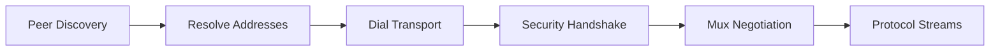
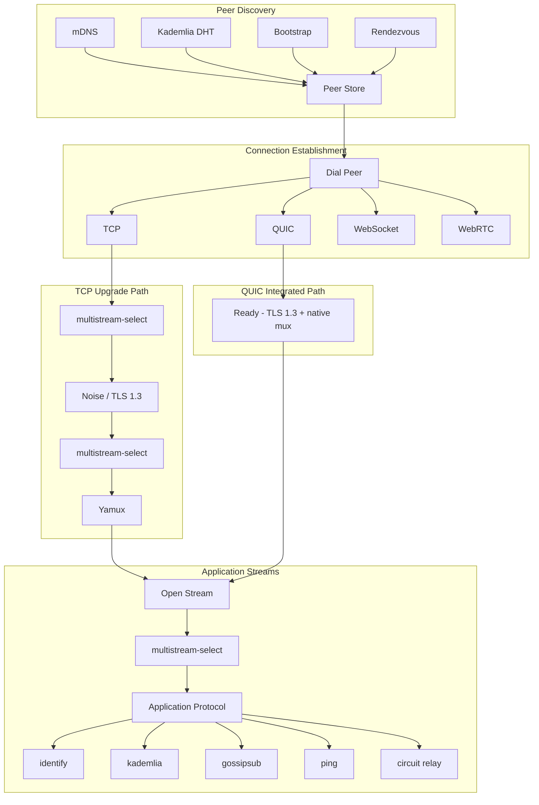

# libp2p Protocol Stack Overview

> A systems-level guide to understanding the libp2p networking architecture,
> protocol layering, and how transports, security, and multiplexing interact.

## Table of Contents

- [Introduction](#introduction)
- [Layered Architecture](#layered-architecture)
- [Transport Layer](#transport-layer)
- [Security Layer](#security-layer)
- [Stream Multiplexing Layer](#stream-multiplexing-layer)
- [Protocol Negotiation](#protocol-negotiation)
- [Application Protocols](#application-protocols)
- [Peer Discovery and Routing](#peer-discovery-and-routing)
- [QUIC as an Integrated Transport](#quic-as-an-integrated-transport)
- [WebRTC and WebTransport](#webrtc-and-webtransport)
- [Architecture Diagram](#architecture-diagram)
- [References](#references)

## Introduction

libp2p is a modular, extensible networking stack designed for peer-to-peer
applications. Unlike traditional client-server architectures, libp2p treats
every participant as a full peer capable of providing and consuming services,
routing traffic, and discovering other nodes.

The core design philosophy of libp2p is **protocol composability**: each layer
of the networking stack is independently selectable and swappable. An application
can choose its transport (TCP, QUIC, WebSocket), its security protocol (Noise,
TLS 1.3), and its stream multiplexer (Yamux, mplex) — and these choices are
negotiated dynamically at connection time.

This document provides a high-level architectural overview to help contributors
understand how the pieces fit together before diving into individual protocol
specifications.

## Layered Architecture

The libp2p stack can be understood through the following conceptual layers:

```
┌─────────────────────────────────────────────────┐
│              Application Protocols              │
│    (identify, kademlia, gossipsub, bitswap)     │
├─────────────────────────────────────────────────┤
│             Protocol Negotiation                │
│            (multistream-select)                 │
├─────────────────────────────────────────────────┤
│            Stream Multiplexing                  │
│              (yamux, mplex)                     │
├─────────────────────────────────────────────────┤
│              Security Layer                     │
│            (Noise, TLS 1.3)                     │
├─────────────────────────────────────────────────┤
│             Transport Layer                     │
│     (TCP, QUIC, WebSocket, WebTransport)        │
├─────────────────────────────────────────────────┤
│              Addressing                         │
│            (multiaddr)                          │
└─────────────────────────────────────────────────┘
```

Each layer has a well-defined responsibility:

| Layer | Responsibility | Example Protocols |
|-------|---------------|-------------------|
| **Addressing** | Encode network addresses in a self-describing format | multiaddr |
| **Transport** | Establish raw connectivity between two endpoints | TCP, QUIC, WebSocket |
| **Security** | Authenticate peers and encrypt communications | Noise, TLS 1.3 |
| **Multiplexing** | Enable multiple independent streams over one connection | Yamux, mplex |
| **Negotiation** | Agree on which protocol to use for a given interaction | multistream-select |
| **Application** | Implement peer-to-peer functionality | identify, kademlia, gossipsub |

## Transport Layer

The transport layer is responsible for establishing raw connectivity between two
network endpoints. libp2p abstracts over multiple transport protocols through a
common interface.

### Supported Transports

- **TCP** — The most widely supported transport. Requires a separate security
  handshake and multiplexer negotiation on top of the raw TCP connection.
- **QUIC** — Provides transport, security (TLS 1.3), and multiplexing in a
  single integrated protocol. See
  [QUIC as an Integrated Transport](#quic-as-an-integrated-transport).
- **WebSocket** — Enables browser-based and HTTP-compatible connectivity. Uses
  the same upgrade path as TCP (security + multiplexer on top).
- **WebTransport** — A browser API running on top of QUIC, allowing connections
  to servers without CA-signed TLS certificates.
- **WebRTC** — Enables browser-to-browser and browser-to-server connectivity
  with built-in NAT traversal.

### Transport Selection

Transports are identified by their multiaddr protocol codes. When dialing a
peer, the libp2p swarm selects the appropriate transport based on the peer's
advertised addresses. For example:

- `/ip4/192.168.1.1/tcp/4001` → TCP transport
- `/ip4/192.168.1.1/udp/4001/quic-v1` → QUIC transport
- `/ip4/192.168.1.1/tcp/443/wss` → WebSocket Secure transport

## Security Layer

Once a raw transport connection is established (for non-integrated transports
like TCP), the next step is to secure the connection. The security layer handles:

1. **Peer authentication** — Verifying the identity of the remote peer using
   cryptographic keys.
2. **Encryption** — Protecting all subsequent communication from eavesdropping.

### Security Protocols

- **[Noise](../noise/README.md)** — The recommended security protocol. Based on
  the Noise Protocol Framework (specifically the `XX` handshake pattern),
  it provides mutual authentication and forward secrecy.
- **[TLS 1.3](../tls/tls.md)** — Used natively by QUIC. For TCP connections,
  libp2p uses a modified TLS 1.3 handshake that embeds the peer's libp2p
  public key in a certificate extension.

### Security Negotiation

For transports that don't have built-in security (e.g., TCP), the security
protocol is negotiated using **multistream-select** immediately after the
transport connection is established.

## Stream Multiplexing Layer

After securing the connection, a stream multiplexer is negotiated (again, for
non-integrated transports). The multiplexer allows multiple independent,
bidirectional streams to be opened over a single connection.

### Why Multiplexing Matters

Without multiplexing, each protocol interaction would require a separate
connection. Multiplexing enables:

- **Efficiency** — A single connection serves many protocols simultaneously.
- **Reduced latency** — No additional connection setup for new protocol streams.
- **Resource conservation** — Fewer open connections and file descriptors.

### Multiplexer Protocols

- **[Yamux](../yamux/README.md)** — The recommended multiplexer. Supports
  flow control, keep-alives, and efficient stream management.
- **[mplex](../mplex/README.md)** — An older, simpler multiplexer. Deprecated
  in favor of Yamux due to lack of proper flow control.

## Protocol Negotiation

**multistream-select** is the protocol negotiation mechanism used throughout
libp2p. It is used to agree on:

1. Which **security protocol** to use (after transport connection).
2. Which **stream multiplexer** to use (after security handshake).
3. Which **application protocol** to use (when opening a new stream).

### How multistream-select Works

```
Initiator                          Responder
    |                                  |
    |--- /multistream/1.0.0 --------->|
    |<-- /multistream/1.0.0 ----------|
    |                                  |
    |--- /noise ---------------------->|
    |<-- /noise -----------------------|
    |                                  |
    (Noise handshake proceeds)
```

The initiator proposes a protocol identifier, and the responder either accepts
it (by echoing it back) or rejects it (by sending `na`). If rejected, the
initiator can propose an alternative.

## Application Protocols

Once a connection is fully established (transported, secured, and multiplexed),
peers can open streams to interact using application protocols. Each stream
is dedicated to a single protocol interaction.

### Core Application Protocols

| Protocol | Purpose | Spec |
|----------|---------|------|
| **[identify](../identify/README.md)** | Exchange peer metadata (keys, addresses, protocols) | identify/README.md |
| **[ping](../ping/ping.md)** | Measure round-trip latency and liveness | ping/ping.md |
| **[Kademlia DHT](../kad-dht/README.md)** | Distributed peer routing and content discovery | kad-dht/README.md |
| **[GossipSub](../pubsub/gossipsub/README.md)** | Scalable pub/sub message dissemination | pubsub/gossipsub/README.md |
| **[Circuit Relay](../relay/README.md)** | Route traffic through intermediary peers | relay/README.md |
| **[AutoNAT](../autonat/README.md)** | Detect NAT and reachability status | autonat/README.md |

### Stream Lifecycle

1. Peer A opens a new stream on the multiplexed connection.
2. multistream-select negotiates the application protocol (e.g., `/ipfs/kad/1.0.0`).
3. The protocol handler processes the stream according to its specification.
4. Either side can close the stream when the interaction is complete.

## Peer Discovery and Routing

Before connections can be made, peers need to discover each other. libp2p
supports multiple discovery mechanisms:

- **Bootstrap nodes** — Well-known peers that provide initial entry into the
  network.
- **[mDNS](../discovery/mdns.md)** — Zero-configuration local peer discovery
  using multicast DNS.
- **[Kademlia DHT](../kad-dht/README.md)** — Distributed hash table for both
  peer routing (finding a peer by its ID) and content routing (finding peers
  that provide specific content).
- **[Rendezvous](../rendezvous/README.md)** — A protocol for registering and
  discovering peers under topic namespaces.

### Discovery → Connection Flow



## QUIC as an Integrated Transport

QUIC deserves special attention because it collapses three layers of the
traditional stack into one:

| Traditional (TCP) | QUIC |
|-------------------|------|
| TCP transport | UDP + QUIC transport |
| Noise/TLS security negotiation | TLS 1.3 built into QUIC handshake |
| Yamux/mplex multiplexing | Native QUIC stream multiplexing |

This means a QUIC connection:

- Does **not** use multistream-select for security or muxer negotiation.
- Achieves a **1-RTT** (or even **0-RTT**) handshake, compared to
  **3+ RTTs** for TCP + Noise + Yamux.
- Still uses multistream-select for **application protocol** negotiation
  on individual streams.

### TCP vs QUIC Connection Setup

```
TCP Path:                          QUIC Path:
  TCP handshake (1 RTT)             QUIC handshake (1 RTT)
  multistream-select (1 RTT)          ↳ includes TLS 1.3
  Noise handshake (1.5 RTT)           ↳ includes mux setup
  multistream-select (1 RTT)        Ready for streams!
  Yamux setup
  Ready for streams!

  Total: ~4.5 RTTs                 Total: 1 RTT
```

## WebRTC and WebTransport

Both WebRTC and WebTransport extend libp2p's reach to browser environments:

- **[WebTransport](../webtransport/README.md)** — Uses the browser's
  WebTransport API over QUIC. Supports connections to servers whose certificate
  hash is known in advance (no CA requirement). Ideal for browser → server.
- **[WebRTC](../webrtc/README.md)** — Supports browser ↔ browser and
  browser ↔ server connectivity. Includes built-in ICE-based NAT traversal.
  Can work with the relay protocol for hole punching via
  [DCUtR](../relay/DCUtR.md).

## Architecture Diagram

The following diagram shows the full protocol flow from peer discovery through
application protocol interaction:



## References

- [Addressing](../addressing/README.md) — How peers encode and interpret
  network addresses.
- [Connections and Upgrading](../connections/README.md) — The connection upgrade
  process in detail.
- [Peer IDs and Keys](../peer-ids/peer-ids.md) — Peer identity and key
  management.
- [Spec Lifecycle](../00-framework-01-spec-lifecycle.md) — How libp2p
  specifications evolve.
- [Roadmap](../ROADMAP.md) — Current and future libp2p development priorities.
