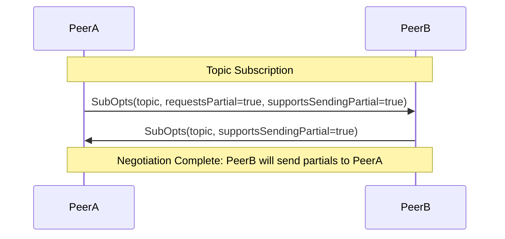
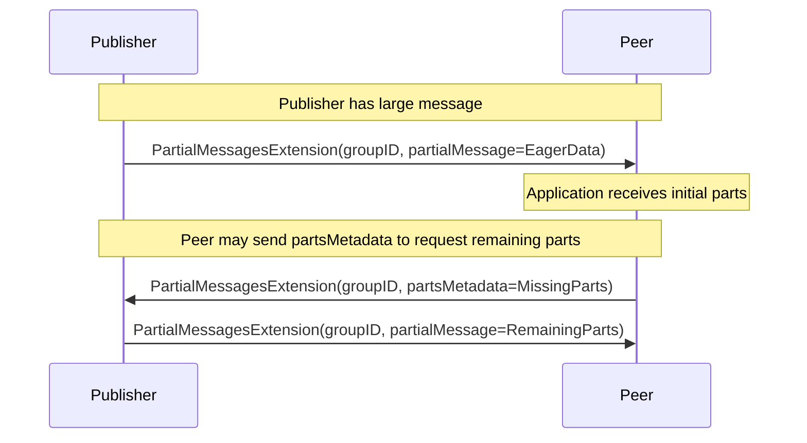
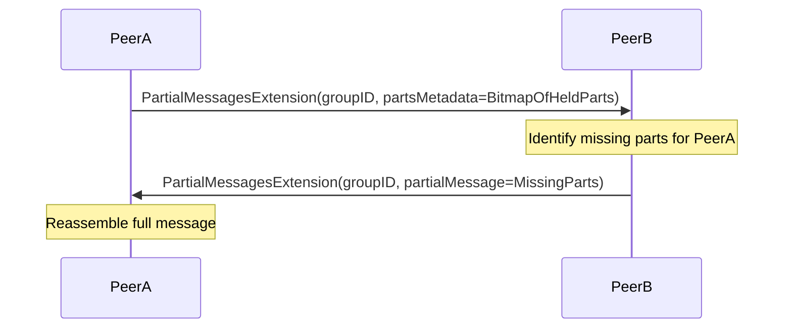
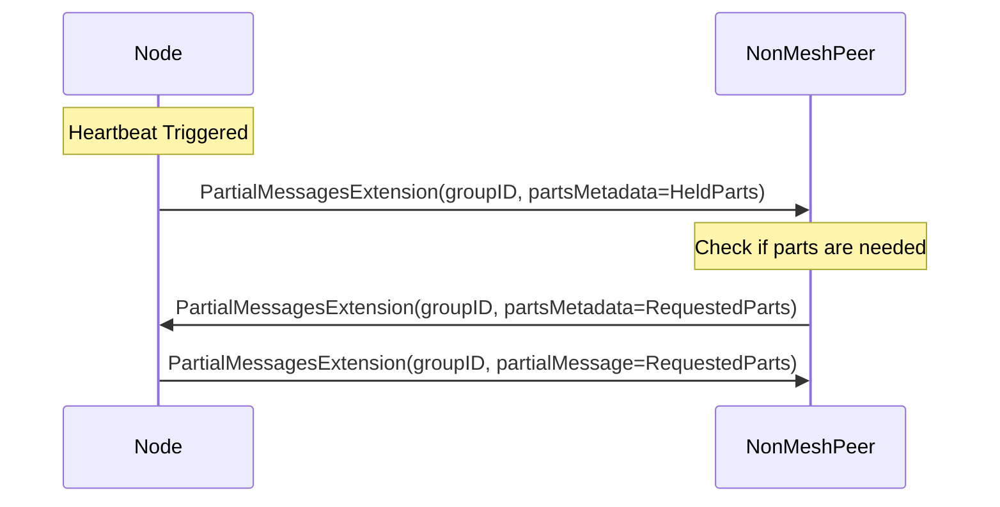

# Partial Messages Extension

| Lifecycle Stage | Maturity      | Status | Latest Revision |
| --------------- | ------------- | ------ | --------------- |
| 1A              | Working Draft | Active | r0, 2025-06-23  |

Authors: [@marcopolo], [@sukunrt], [@jxs], [@cskiraly]

Interest Group: [@jxs], [@dknopik], [@sukunrt], [@raulk]

[@marcopolo]: https://github.com/marcopolo
[@cskiraly]: https://github.com/cskiraly
[@jxs]: https://github.com/jxs
[@raulk]: https://github.com/raulk
[@dknopik]: https://github.com/dknopik
[@sukunrt]: https://github.com/sukunrt

See the [lifecycle document][lifecycle-spec] for context about the maturity level
and spec status.

[lifecycle-spec]: https://github.com/libp2p/specs/blob/master/00-framework-01-spec-lifecycle.md

## Overview

Partial Messages Extensions allow users to transmit only a small part of a
message rather than a full message. This is especially useful in cases where
there is a large message and a peer is missing only a small part of the
message.

## Terms and Definitions

**Full Message**: A Gossipsub Message.

**Message Part**: The smallest verifiable part of a message.

**Partial Message**: A group of one or more message parts.

**Group ID**: An identifier to some Full Message. This must not depend on
knowing the full message, so it can not simply be a hash of the full message.

**Parts Metadata**: Metadata used to communicate a node's state about its
available message parts.

**Eager Data**: Data pushed to a peer before receiving their `PartsMetadata`

## Motivation

The main motivation for this extension is optimizing Ethereum's Data
Availability (DA) protocol. In Ethereum's upcoming fork, Fusaka, custodied data
is laid out in a matrix per block, where the rows represent user data (called
blobs), and the columns represent a slice across all blobs included in the block
(each blob slice in the column is called a cell). These columns are propagated
with Gossipsub. At the time of writing it is common for a node to already have
all the blobs from its mempool, but in cases where it doesn't (~38%[1]) have
_all_ of the blobs it almost always has _most_ of the blobs (today, it almost
always has all but one [1]). More details of how this integrates with Ethereum
can be found at the [consensus-specs
repo](https://github.com/ethereum/consensus-specs/pull/4558)

This extension would allow nodes to only request the column message part
belonging to the missing blob. Reducing the network resource usage
significantly. As an example, if there are 32 blob cells in a column and the
node has all but one cell, this would result in a transfer of 2KiB rather than
64KiB per column. and since nodes custody at least 8 columns, the total savings
per slot is around 500KiB.

Later, partial messages could enable further optimizations:

- If cells can be validated individually, as in the case of DAS, partial
  messages could also be forwarded, allowing us to reduce the store-and-forward
  delay [2].
- Finally, in the FullDAS construct, where both row and column topics are
  defined, partial messages allow cross-forwarding cells between these topics
  [2].

## Advantage of Partial Messages over smaller Gossipsub Messages

Partial Messages within a group imply some structure and correlation. Thus,
multiple partial messages can be referenced succinctly. For example, parts can
be referenced by bitmaps, ranges, or a bloom filter.

The structure of partial messages in a group, as well as how partial messages
are referenced is application defined.

If, in some application, a group only ever contained a single partial message,
then partial messages would be the same as smaller messages.

## Protocol Messages

The following section specifies the semantics of each field in the protocol
message.

### partialMessage

The `partialMessage` field encodes one or more parts of the full message. The
encoding is application defined.

### partsMetadata

The `partsMetadata` field encodes the parts a peer has and wants. The encoding
is application defined. An unset value carries no information besides that the
peer did not send a value.

Upon receiving a `partsMetadata` a node SHOULD respond with only parts the peer
doesn't have.

A later `partsMetadata` replaces a prior one.

During heartbeat gossip, `partsMetadata` can be used to inform a random subset
of non-mesh topic peers about the parts held by this node, similar to full
message IHAVE gossip.

Implementations are free to select when to send an update to their peers based
on signaling bandwidth tradeoff considerations.

### Changes to `SubOpts` and interaction with the existing Gossipsub mesh.

The `SubOpts` message is how a peer subscribes to a topic.

Partial Messages uses the same mesh as normal Gossipsub messages. It is a
replacement to full messages. A node requests a peer to send partial messages
for a specific topic by setting the `requestsPartial` field in the `SubOpts`
message to true. A node signals support for sending partial messages on a given
topic by setting the `supportsSendingPartial` field in `SubOpts` to true. A node can
support sending partial messages without wanting to receive them.

If a node requests partial messages, it MUST support sending partial messages.

A node uses a peer's `supportsSendingPartial` setting to know if it can send
`partsMetadata` to a peer. It uses its `requestsPartial` setting to know whether
to send the peer a full message or a partial message.

If a peer supports partial messages on a topic but did not request them, a node
MUST omit the `partialMessage` field of the `PartialMessagesExtension` message
when sending a message to this peer. In other words, it MUST NOT send this peer
encoded partialMessage data since it did not request it.

If a node does not support the partial message extension, it MUST ignore the
`requestPartial` and `supportsPartial` fields. This is the default behavior of
protobuf parsers.

The `requestPartial` and `supportsPartial` fields value MUST be ignored when a
peer sends an unsubscribe message `SubOpts.subscribe=false`.

#### Behavior table

The following table describes the expected behavior of receiver of a `SubOpts`
message for a given topic.

| SubOpts.requestsPartial | behavior of receiver that supports partial messages for the topic                                 |
| ------------------------ | ------------------------------------------------------------------------------------------------- |
| true                     | The receiver SHOULD send partial messages (data and metadata) to this peer.                       |
| false                    | receiver MUST NOT send partial message data to this peer. The receiver SHOULD send full messages. |

| SubOpts.requestsPartial | behavior of receiver that does not support partial messages for the topic |
| ------------------------ | ------------------------------------------------------------------------- |
| \*                       | The receiver SHOULD send full messages.                                   |

| SubOpts.supportsSendingPartial | behavior of receiver that requested partial messages for the topic                                               |
| ------------------------ | ---------------------------------------------------------------------------------------------------------------- |
| true                     | The receiver expects the peer to respond to partial message requests, and receive `partsMetadata` from the peer. |
| false                    | The receiver expects full messages.                                                                              |

| SubOpts.supportsSendingPartial | behavior of receiver that did not request partial messages for the topic |
| ------------------------ | ------------------------------------------------------------------------ |
| \*                       | The receiver expects full messages                                       |

## Partial Message Gossip

Partial Messages SHOULD replace Gossipsub's IHAVE/IWANT with a message that
provides more context (via the Group ID) and allows for partial responses.

When Gossiping, a node that supports partial messages SHOULD NOT send an `IHAVE`
to a peer that requested partial messages. The node SHOULD send a partial message
instead.

## Sequence Diagrams

### Extension Negotiation

Peers use the subscription options to negotiate support for the Partial Messages extension. Setting `requestsPartial` to true indicates a preference for receiving partial messages, while `supportsSendingPartial` signals the ability to serve them.

### Eager Push Flow

A publisher can choose to send "Eager Data"—initial parts of a message—directly to a peer without waiting for a request or metadata exchange. This minimizes latency for large message propagation.

### partsMetadata Exchange Flow

Peers use `partsMetadata` to synchronize which parts of a message they already possess. Upon receiving metadata, a peer responds with the specific missing parts, enabling efficient reassembly.

### Heartbeat Gossip with Partial Messages

During the periodic heartbeat, a node can announce held parts to non-mesh peers using `partsMetadata`. This replaces the standard `IHAVE` gossip with more granular information, allowing peers to synchronize missing parts.

## Application-Library Interface

Both `partsMetadata` and `partialMessage` in the Partial Message RPC are
application defined. Therefore, Gossipsub implementations MUST forward these
messages to the application for it to act on them. This is true regardless if
the sender is in our mesh or not.

At a high level libraries need to provide two things:

1. A way for the application to receive incoming partial messages.
2. A way for the application to send partial messages to mesh peers and other
   non-mesh peers (as is the case when responding to gossip or fanout).

An implementation MAY choose to provide more, but SHOULD NOT provide less.

Implementations are encouraged to look at `go-libp2p-pubsub` and `rust-libp2p`
for two different designs.

## Fanout and Gossip messages

Fanout and Gossip messages by definition come from non-mesh peers. Partial
messages, without eager data, require an exchange of bitmaps before parts are
transferred. In order for fanout and gossip messages to be useful, the
Application MUST be able to send partial messages to these peers.

## Implementation Recommendations

The following section is not intended to be normative, it is only meant to
provide rough recommendations to implementations.

### Reacting to `IHAVE`

If a node is reconstructing a message with partial message extension, it MAY
prefer to delay reacting to a peer's `IHAVE` message in order to give the
opportunity for a partial message request to finish and get the message more
efficiently.

### DoS Resiliency

As with everything in gossipsub it is important to limit the amount of peer
initiated state the implementation tracks. If possible, defer the decision of
whether to persist state to the application, as it can do application-specific
validation of the message.

### Eager pushing data

An application MAY choose to send data eagerly to a peer before it has received
its `partsMetadata`. Implementations SHOULD support this.

### Minimizing unnecessary messages

Some applications may be able to infer updates to `partsMetadata` from sent and
received messages. Applications SHOULD leverage this to reduce the number of
messages sent to a peer.

## Upgrading a topic to use partial messages

Rolling out partial messages on an existing topic allows for incremental
migration with backwards compatibility. The steps are as follows:

1. Deploy nodes that support partial messages, but do not request them for the
   target topic. The goal is to seed support for partial messages before making
   the switch. Nodes signal their support for partial messages by setting the
   subscribe option `supportsSendingPartial` to true.
2. Slowly deploy and monitor nodes that request (and implicitly support) partial
   messages. These nodes should find peers that send them partial messages from
   the previous step. Nodes request partial messages by setting the subscribe
   option `requestPartial` to true.

### Supporting both full and partial messages for a topic

Partial messages use the same mesh as full messages. Supporting both is
straightforward. If a peer subscribes to a topic with a `requestPartial`, the
node SHOULD send the peer partial messages. Otherwise, send the node full
messages.

On the receiving side, if the node is in a mixed network of partial and full
messages, and it requests partial messages, the node MUST support receiving full
messages.

## Creating a topic to only use partial messages

There is currently no mechanism to require that a topic only be used for partial
messages. A future extension may define this.

With this extension nodes can choose to only graft peers that support partial
messages, and prune those that do not.

## Protobuf

Refer to the protobuf registry at `./extensions/extensions.proto`

[1]: https://ethresear.ch/t/is-data-available-in-the-el-mempool/22329
[2]: https://ethresear.ch/t/fulldas-towards-massive-scalability-with-32mb-blocks-and-beyond/19529#possible-extensions-13
